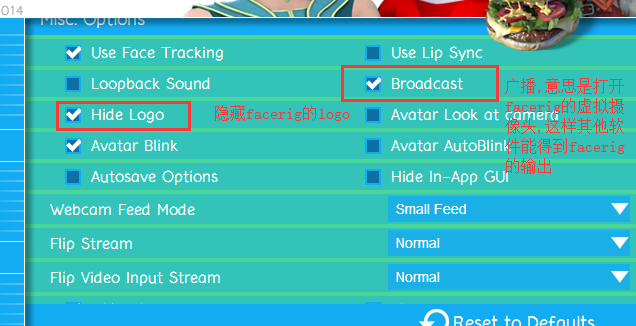

#facerig配置

建议图像这么设置 如果卡性能栏可以设置地一点

#程序使用说明

先开facerig
然后打开这个 启动时会检测facerig的虚拟摄像头获取视频流 

- 右下角托盘图标可以右键  选择是否打开麦克风(不带耳机会有回音) ,重载和退出

#源码打包

- 确保有cnpm命令
安装依赖:cnpm install
依赖安装后:
运行: electron .
打包: electron-packager .
